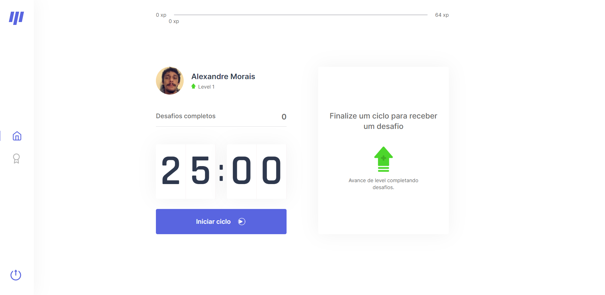

<div align="center">

# Moveit

This application was developed during NLW04, made by [Rocketseat](https://rocketseat.com.br/). 🚀

<p>
  
</p>

<p>
  
</p>

</div>

<div align="center">

[](https://nextjs.org/)
[](https://github.com/styled-components/styled-components)
[](https://www.typescriptlang.org)
[](https://lottiefiles.com)
[](https://www.framer.com/motion/)
[](https://next-auth.js.org/)
[](https://auth0.com/#!)

</div>

#

## Preview

[](https://moveit-xandowski.vercel.app/)

#

## Getting started

```
$ git clone https://github.com/xandowski/moveit.git && cd moveit
```

Follow the steps:

```
$ yarn or npm install
```

create a .env.local file based on .env.example

you need to set up prod variables on vercel in settings if you need to use the authentication, check documentation [environment-variables](https://nextjs.org/docs/basic-features/environment-variables). This [video](https://www.youtube.com/watch?v=o_wZIVmWteQ) may help you.

#

## Layout

- [Layout 1.0](<https://www.figma.com/file/LHfsSLWLc13Eqttovqcp9R/Move.it-1.0-(Copy)?node-id=160%3A2761>)
- [Layout 2.0](<https://www.figma.com/file/U7GuRO1gGGglsOv5pzjT6d/Move.it-2.0-(Copy)?node-id=149822%3A74>)

## Some useful links

- [NextJS](https://nextjs.org/docs/getting-started) - NextJS getting started
- [ReactJS](https://reactjs.org/docs/getting-started.html) - ReactJS getting started
- [Styled-components](https://styled-components.com/docs/basics#getting-started) - styled-components getting started
- [TypeScript](https://www.typescriptlang.org/docs/) - Typescript getting started
- [NodeJS](https://nodejs.org/en/) - NodeJS docs
- [VSCode](https://code.visualstudio.com/) - My favorite code editor
- [Discord](https://discord.gg/rYYTbuhD) - Rocketseat discord server
- [ESLint](https://eslint.org/docs/user-guide/getting-started) - Eslint getting started
- [Framer Motion](https://www.framer.com/api/motion/) - Motion API
- [Lottie](https://lottiefiles.com/what-is-lottie) - About lottie
- [Nextauth](https://auth0.com/authentication) - Getting Started
- [Auth0](https://next-auth.js.org/getting-started/example) - Getting Started

### If you need some help, contact me, [instagram](https://www.instagram.com/alexandre.moraiis/) or on discord Xandowski#0512.

#

## The application is still under development.

## Home


