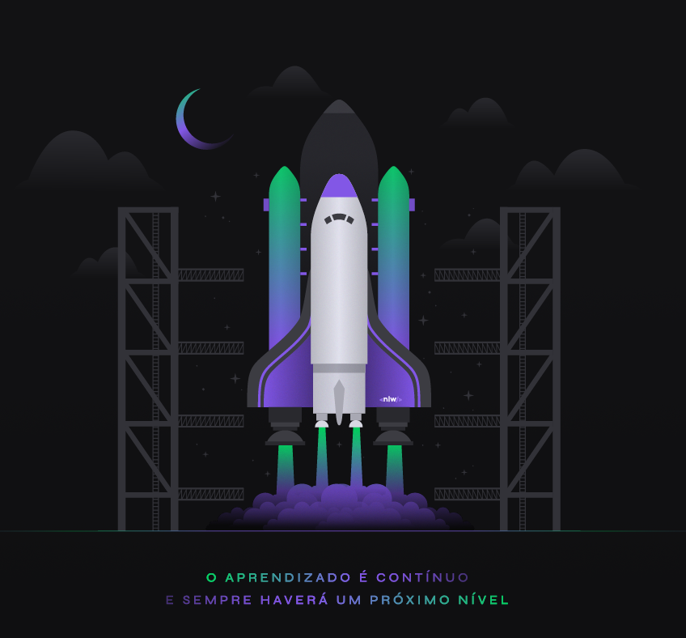

# Moveit

This is an application made in next-level-week-4 powered by [Rocketseat](https://rocketseat.com.br/). 🚀

  

## Layout

- [Figma](https://www.figma.com/file/ge20pu3ofMOKoliUyKx1Nl/?viewer=1&node-id=160:2761)

## Some useful links

- [NextJS](https://nextjs.org/docs/getting-started) - NextJS getting started
- [ReactJS](https://reactjs.org/docs/getting-started.html) - ReactJS getting started
- [Styled-components](https://styled-components.com/docs/basics#getting-started) - styled-components getting started
- [TypeScript](https://www.typescriptlang.org/docs/) - Typescript getting started
- [NodeJS](https://nodejs.org/en/) - NodeJS docs
- [VSCode](https://code.visualstudio.com/) - My favorite code editor
- [Discord](https://discord.gg/rYYTbuhD) - Rocketseat discord server
- [ESLint](https://eslint.org/docs/user-guide/getting-started) - Eslint getting started
- [Framer Motion](https://www.framer.com/api/motion/) - Motion API
- [Lottie](https://lottiefiles.com/what-is-lottie) - About lottie